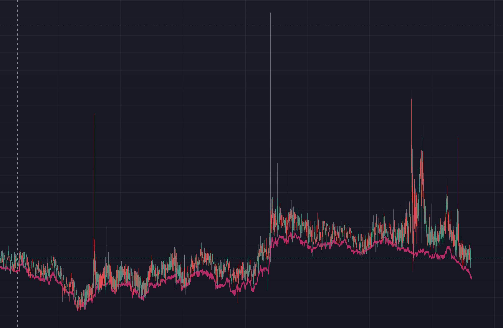

# Kimchi_Premium_Strategy_Implementation

## 배경

> 환율이란 화폐의 상대적 가치이다.

내가 두가지 화폐를 사고팔고 할 것이라면, 트레이딩뷰를 통해 아주 예쁘게 환율 그래프를 그릴 수 있다.
상대적 가치이기 때문에 심지어 화폐를 가지고 할 필요도 없다. 삼성가격/애플가격 이런식으로 해도 상관없는 것이다.

**하지만, 삼성가격/애플가격과는 다르게 환율은 국가에서 화폐가치를 통제한다.**
따라서, 빅맥지수도 실질 물가가 반영된 환율을 보여주지만, 환율을
크게 벗어날 수는 없다. 즉, 서로 다른 국가에서 각자 팔고 있는 같은 물건가격의 상대적 가치는 거시적으로
국제환율을 추종한다.

하지만, 빅맥지수에서 보듯, 각자 국가의 사정이 다르기 때문에 정세, 물가 등에
따라서 국제환율을 종종 이탈하는 경우가 발생한다. 코인도 마찬가지이다. 같은 비트코인이지만, 국가적
정세, 국가의 디지털 전략, 군중심리 등에 따라서 특정국가에서 코인 가격이 상대적으로 비싸지는 현상이
발생해 왔고, 김치프리미엄은 그 대표적인 현상이다.

아래 그림은 특정 알트코인의 "국내 거래소 가격 / 해외 거래소 가격"을 보여주는 차트이다.
국제환율을 크게 벗어나는 구간이 종종 보인다. 아주 짧은 시간에 국내에서 고평가 되었다는 것이고, 이는
해당 코인의 국내 가격의 폭발적 상승 혹은 해외 가격의 폭발적 하락을 의미한다.

국내거래소는 해외거래소처럼 선물을 제공하지 않으므로, 매수밖에 되지 않고, 해외거래소는 선물을 제공하기 때문에
매도가 가능하다. 따라서, 만약에 같은 코인을 국내거래소에서는 100개를 매수하고, 해외거래소에서는 매도를 한다면,
우리는 사실상 0개를 산 것이지만, 만약에 국내거래소 가격 / 해외거래소 가격이 상승하게 되면, 이득을 보게 된다.
이것이 바로 선물을 이용한 환차익 거래이다.

따라서, 위 그림에서 보듯이, 낮은 구간에서 포지션을 진입하고, 높은 구간에서 포지션을 종료하는 전략을 자동으로
하려고 하며, 해당 전략은 앞서도 말했듯이 거시적으로 환율을 추종하기 때문에 환율리스크를 전제한다. 실제로 2025년
초에 비해 중반기까지 환율은 1500원에서 1350원까지 떨어졌으며 앉아서 10%나 손해를 보게 되기 때문에 알트코인을
직접 매수하는 것보다는 로우 리스크이지만, 여전히 절대적으로 로우 리스크라고 할 수는 없다.

하지만, 역사적으로 불장시기에 김치프리미엄은 폭등을 하였으며, 김치프리미엄이 100%에 이르는 역대급 김치코인들도
많이 나왔지만, 단점은 세력, 시황에 따라서 이러한 차트에서 아웃라이어가 발생하므로, 언제 올지 예측이 힘들다는 점이다.

그럼에도 불구하고, 필자는 다시한번 불장이 올 것이라고 믿으며, 김치프리미엄 자동매매를 구현하고자 한다.

## 전략

기본적으로 김치프리미엄 환율을 실시간으로 감시하여 환율이 낮을 때 들어가서 환율이 높을 때 종료하려고 한다.
해당 전략에 드는 비용을 생각해보자. 업비트 원화 입금, 출금 수수료는 생략한다.

> #### 비용

- 국내거래소 -> 해외거래소 테더 전송비
- 포지션 진입 수수료 (시장가)
- 포지션 종료 수수료 (시장가)
- 해외거래소 -> 국내거래소 테더 전송비

요즘, 온체인 테더 전송비는 거의 들지 않는 편이므로, 거래소 수수료만 생각해도 무방하고, 이론적으로는
포지션 진입보다 종료시에 해당 코인의 환율이 0.15%보다 높아지면 이득이다. 또한, 환율 계산을 쉽게 하기
위해 국내거래소, 해외거래소에서 같은 사이즈의 코인만 들어가는 것이 편리하다.

**위 전략에서 가장 중요한 고려할 점은 거래시 슬리피지이다.**
거래소는 순위권에 드는 거래소를 사용하는 것이 유리한데,
그 이유는 유동성 때문이다. 사람들이 잘 안 사용하는 거래소는 유동성이 부족해서 호가창을 실제로 보게 되면
코인 몇개만 사도 가격이 무너지게 되어 있다. 물론 시총이 큰 알트코인인 리플을 들어갈 수도 있겠지만,
잡알트에 비해서 흔들리는 폭이 적다. 따라서, 시총이 작은 코인이되, 호가창에서 내 시드로 진입할 때에 환율을
실시간으로 계산해서 들어갈 수 있는 그런 시스템이 필요하다.

**거래소에서 입출금이 막힌 코인은 거래하지 않는다.**
입출금이 막히게 되면, 김치프리미엄이 엄청나게 되는데, 이게 우리가 흔히들 얘기하는 가두리 양식장이다.
유동성이 돌지를 못해서 가격이 서로 차이가 나게 되는 것으로, 이런 코인은 거래하면 안된다.

> #### 세부전략

국내거래소와 해외거래소의 공통 거래가능 코인들 전체에 대해 실시간으로 환율을 계산하고,
테더가격(국제환율로 가정하자, 실제로 테더를 원화로 환전할 수 있으므로 이게 더 정확하다고 볼 수 있다.)과
이를 비교하여 테더가격보다 떨어지는 코인에 대해 포지션을 진입하고, 포지션이 체결되면, 해당 코인에 대해서는
매 10초마다 실시간 환율 감시를 하고, UI에서 매도 환율을 입력저장해놓으면 해당 환율에 도달하였을 때, 포지션을
종료한다.

## 구현

**알트코인의 김치 프리미엄 갭을 활용한 자동매매 전략을 구현한다.**

설계는 확장성을 고려하되, 시간이 없기 때문에 빠른 구현을 목적을 한다. 따라서, 현재 내가 매매에 사용하는 두 거래소를
기준으로 구현한다.

> 전제조건

- 한국거래소 : Upbit
- 해외거래소 : Bybit
- 메인 사용언어 : python
- 프레임워크 : fastapi, celery
- DB : AWS elasticache (redis), sqlite3
- 패키지 관리 툴 : uv

> 인프라 & 요구사항

- 메인 인스턴스 : AWS ec2 인스턴스

  - 포지션 자동 진입/종료하는 데몬

    - 조건을 만족하면 진입/종료한다.
    - WAS가 종료되면 데몬도 종료되어야 함

  - 데몬 스케줄러

    - 매 5분마다 "공통 진입가능 티커" 목록을 갱신하는 스케줄러
      - upbit, bybit 거래소 api통해 거래가능티커 수신하여 db insert
      - 업비트 티커에 대해 입출금 가능여부 db update
    - 매분마다 celery를 통해 AWS SQS큐에 "공통 진입가능 티커"들을 큐에 삽입하는 스케줄러 수행

  - fast api & react를 이용한 관리자 UI
    - 현재 감시할 티커 autocomplete 태그 추가
      - 선택완료되면, 해당 티커의 환율 차트를 볼 수 있도록 한다. 
      
    - 메뉴얼로 제외할 감시목록 티커 인풋박스 추가
      - "공통 진입가능 티커" 목록에서 제외(이렇게 수동으로 제외한 티커는 데몬에서 목록 갱신되어도 계속 제외되어야함)
      - 스케줄러와 웹어플리케이션이 "공통 진입가능 티커"라는 리소스를 DB를 통해 공유
    - 각각의 거래소에서 현재 주문가능금액을 보여준다.
    - 시드 입력할 인풋박스
      => 포지션 진입시 입력한 시드 기준으로 수행. 또한, 호가창 반영 워커 인스턴스에서도 입력한 시드를 기준으로 계산.
    - 진입/종료시 %를 설정할 수 있는 인풋박스
      => 진입 1% / 종료 1% : 테더가격보다 환율이 1%낮을 때 진입해서 종료는 테더가격보다 환율이 1%높을 때 종료
    - 만약을 대비한 수동 포지션 종료 버튼
    - 포지션 진입해서 아직 종료하지 않은 포지션에 대해 클라이언트 소켓을 통해서 실시간으로 손익을 계산해서 display.
    - 포지션 진입시 오더 identifier를 셋팅하므로, 해당 identifier가 셋팅되어 있는 거래들만 발췌해서 매매내역 보여줌.
    - 스케줄러 실행/종료 버튼

- 워커 인스턴스 : AWS ec2 인스턴스
  - AWS SQS큐에서 poll하여 호가창 반영 환율 계산 task 수행
  - 아래의 제약조건에서 명시하였듯이, 거래소 api limit을 고려하였을 때, 현재기준으로 5개이상이 필요하다. 구글 아이디 4개까지 신규가 가능하므로 해당 아이디들 각각 프리티어 ec2 인스턴스를 돌릴 수 있다.
  - 메인, 워커 인스턴스에서 공통으로 접근, 갱신할 수 있는 DB로 AWS redis를 사용

> 제약조건

- 업비트는 초당 30회 요청 가능
- 바이비트는 초당 120회 요청 가능
- 공통티커는 2025년 6월 기준 총 131개
- 호가창 api는 티커 파라미터 1개만 가능하므로, 131개에 대해 실시간으로 호가창이 반영된 환율을 계산하려면, 최소 서로 다른 ip를 가진 인스턴스 5개를 돌려야한다.
- 워커 인스턴스를 AWS Lambda로 서버리스로 스크립트만으로 task수행을 하고 싶었으나, 거래소 ip 제한 때문에 불가

> Infrastructure Diagram (made by mermaid)
> 
